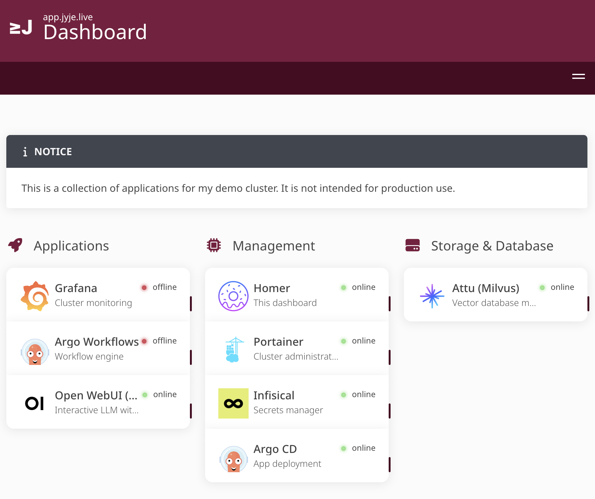
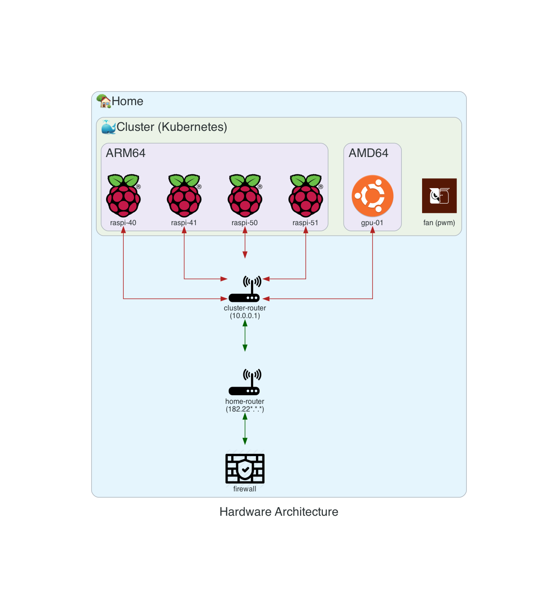

# jyje/cluster

## Kubernetes Cluster v2
Second version of my Raspberry Pi cluster powered by MicroK8s.

Keywords: DevOps, MLOps, LLMOps, DevSecOps, MicroK8s

## Introduction
The first version was a private project, but it has lots of secrets and sensitive information.
So, I decided to create a new one from scratch and make it public.
The helm carts are moved to [**helm-charts**](https://github.com/jyje/helm-charts) repository.

## Architecture

## Maintainers
- [jyje](https://github.com/jyje)

## License
MIT
