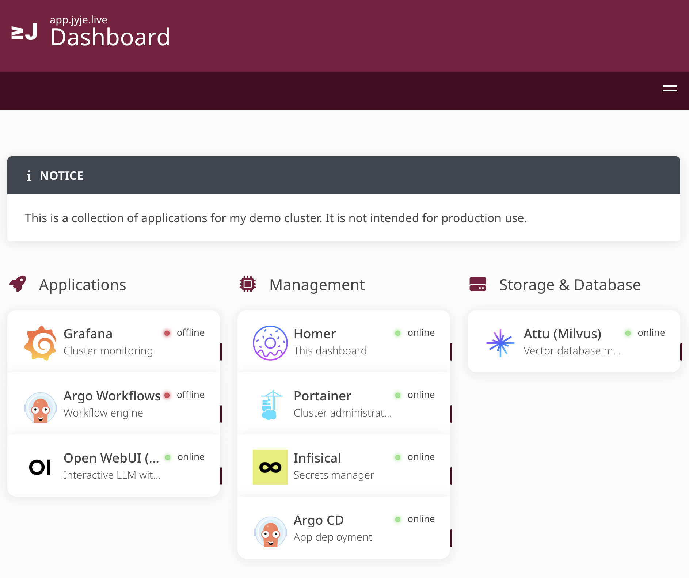
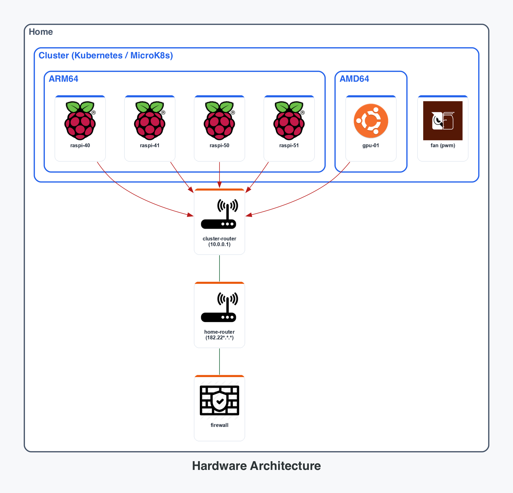
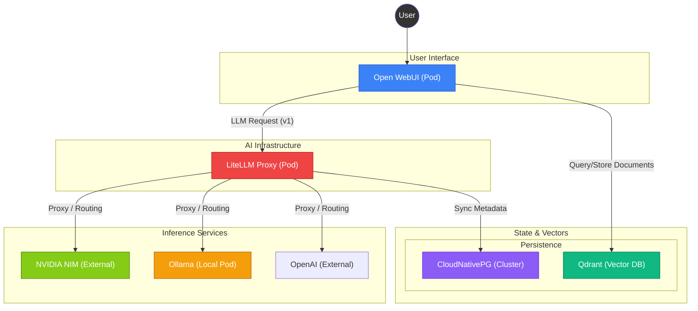

# jyje/cluster

## Kubernetes Cluster v2
Second version of my Raspberry Pi cluster powered by MicroK8s.
Keywords: **DevOps**, **MLOps**, **LLMOps**, **GitOps**, **Service Mesh**, **MicroK8s**

This is a self-hosted, sovereign Kubernetes cluster built on Raspberry Pi hardware. It represents a "Production-grade HomeLab" where enterprise-level technologies are implemented in a resource-constrained environment.

This v2 cluster focuses on **Declarative Everything**, **Flexible AI Serving**, and **Hybrid Storage Governance**.

> [!NOTE]
> Service Mesh (Istio Ambient) is currently in evaluation and temporarily disabled for resource optimization.

## Technical Architecture

### 1. Hardware Stack

- **Platform**: 4x Raspberry Pi 4/5 (8GB RAM each)
- **Orchestration**: [MicroK8s](https://microk8s.io/)
- **OS**: Debian GNU/Linux 12 (bookworm)

### 2. Networking & Service Mesh
- **Service Mesh**: **Istio Ambient Mesh** (Evaluation / Temporarily disabled)
- **Ingress**: NGINX Ingress Controller
- **Load Balancer**: MetalLB (L2 mode)
- **DNS/Certs**: Cert-manager with Cloudflare integration

### 3. LLMOps Architecture

```mermaid
graph TD
    subgraph UI_Layer [User Interface]
        OWUI["Open WebUI (Pod)"]
    end

    subgraph LLM_Orchestration [AI Infrastructure]
        LiteLLM["LiteLLM Proxy (Pod)"]
    end

    subgraph Storage [State & Vectors]
        subgraph Persistence
            CNPG["CloudNativePG (Cluster)"]
            Qdrant["Qdrant (Vector DB)"]
        end
    end

    subgraph LLM_Backends [Inference Services]
        NIM["NVIDIA NIM (External)"]
        Ollama["Ollama (Local Pod)"]
        OpenAI["OpenAI (External)"]
    end

    %% Flow Relationships
    User((User)) --> OWUI
    OWUI -- "LLM Request (v1)" --> LiteLLM
    OWUI -- "Query/Store Documents" --> Qdrant

    LiteLLM -- "Proxy / Routing" --> NIM
    LiteLLM -- "Proxy / Routing" --> Ollama
    LiteLLM -- "Proxy / Routing" --> OpenAI
    LiteLLM -- "Sync Metadata" --> CNPG

    %% Styling
    style User fill:#333,color:#fff
    style OWUI fill:#3b82f6,color:#fff,stroke:#1d4ed8
    style LiteLLM fill:#ef4444,color:#fff,stroke:#b91c1c
    style Qdrant fill:#10b981,color:#fff,stroke:#047857
    style CNPG fill:#8b5cf6,color:#fff,stroke:#6d28d9
    style NIM fill:#84cc16,color:#fff,stroke:#4d7c0f
    style Ollama fill:#f59e0b,color:#fff,stroke:#b45309
```

### 4. GitOps & Secrets
- **Continuous Delivery**: [ArgoCD](https://argoproj.github.io/cd/)
- **Secrets**: Sealed Secrets & [Infisical](https://infisical.com/)

### 5. Storage Strategy
- **Object Storage**: [SeaweedFS](https://github.com/seaweedfs/seaweedfs) (S3-compatible)
- **Distributed Block**: [Longhorn](https://longhorn.io/)
- **Legacy Storage**: NFS Subdir External Provisioner

## Key Features
- **ARM64 Optimized**: All components are tailored for AARCH64.
- **Hybrid Storage**: Combining high-performance block storage with scalable object storage (SeaweedFS).
- **Flexible AI**: Integrated with NVIDIA NIM for high-performance inference, with future plans for **Private LLM** infrastructure (e.g., NVIDIA DGX Spark).
- **Observability**: LGTM Stack (Loki, Grafana, Tempo, Mimir) for full-stack monitoring.

## Maintainers
- [jyje](https://github.com/jyje)

## License
MIT
